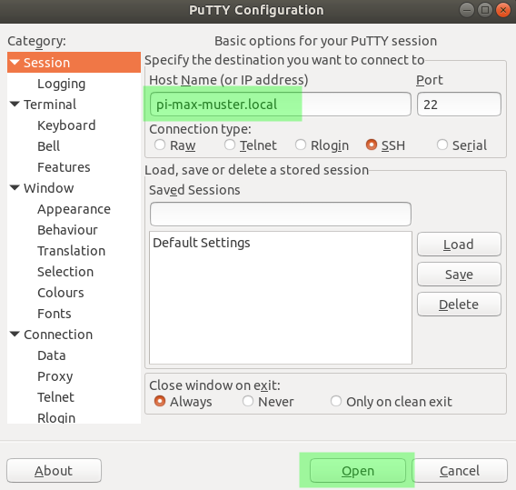

# How to use
1. Download latest release of *HTLRbian* ([here](https://github.com/semiversus/htlrbian/releases/download/1.1.0/2020-12-02-htlrbian-buster.zip)) and unzip it locally
2. Use [Etcher](https://www.balena.io/etcher/) to write the image to your SD card
3. Re-insert the SD card on your PC and open file `htl.txt` on drive `boot`
4. Enter your HTL Rankweil username and password and save the file
5. Unmount the SD card and boot your Raspberry Pi with the SD card
6. The Raspberry Pi will announce its IP address via https://ip.semiversus.com. If your computer supports *Bonjour Service* you can ping your Raspberry via hostname `pi-max-muster.local` (in this case the username was `max.muster`).
7. Use SSH client [Putty](https://the.earth.li/~sgtatham/putty/latest/w32/putty.exe) or Shellinabox (using webbrowser and your IP) to connect to your Raspberry Pi.
8. Username for login is `pi`, password is your HTL Rankweil password

If you're unable to ping your Raspberry via `pi-max-muster.local` (please adapt here your username), you may have to install the [Bonjour Service](https://support.apple.com/kb/DL999).

# What is included
* Windows Network Drive support via samba
* SSH Server
* ShellInABox via http Port 80
* [NoMachine](https://www.nomachine.com) Remote Desktop
* IP lookup via [ip.semiversus.com](https://ip.semiversus.com)
